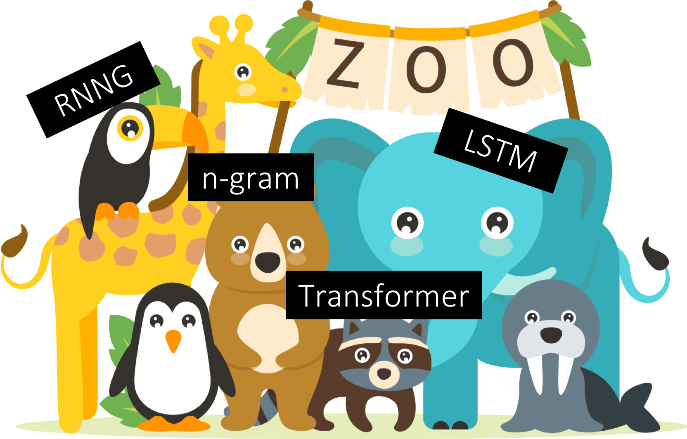
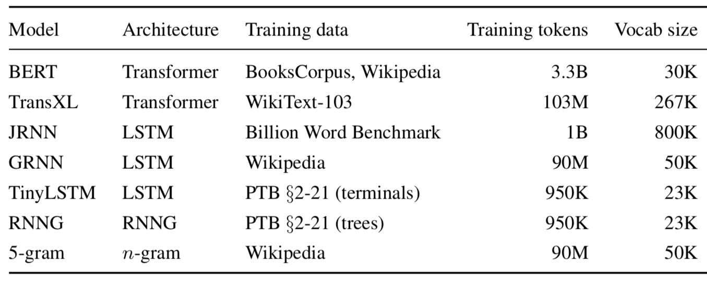

# Pre-trained language model zoo



[](https://circleci.com/gh/cpllab/language-models/tree/docker)

This folder contains scripts for obtaining surprisals from the following pre-trained language models:

1. [GRNN](https://github.com/facebookresearch/colorlessgreenRNNs)
2. [JRNN](https://github.com/tensorflow/models/tree/master/research/lm_1b)
3. [RNNG](https://github.com/clab/rnng)
4. [Transformer-XL](https://github.com/kimiyoung/transformer-xl)
5. [Tiny LSTM](https://github.com/pytorch/examples/tree/master/word_language_model)
6. 5-gram with Kneser-Ney smoothing
7. **coming soon**: [BERT](https://github.com/google-research/bert)



The models use the following tokenizers:

| Model | Tokenizer |
| :---: | :--------------: |
| GRNN  | [TreeTagger](https://www.cis.uni-muenchen.de/~schmid/tools/TreeTagger/) |
| JRNN  | [WMT11 tokenizer](http://statmt.org/wmt11/translation-task.html) |
| RNNG  | [PTB tokenizer](https://www.nltk.org/_modules/nltk/tokenize/treebank.html) |
| Tiny  | [PTB tokenizer](https://www.nltk.org/_modules/nltk/tokenize/treebank.html) |
| Trans | Moses ([one implementation](https://github.com/OpenNMT/OpenNMT-py/blob/master/tools/tokenizer.perl)) |
| ngram | [TreeTagger](https://www.cis.uni-muenchen.de/~schmid/tools/TreeTagger/) |

The parameters are taken from the standard published version of each model unless stated otherwise.

## Scripts

Surprisals can be obtained from each model using the script `eval_<MODEL>.sh` in the `scripts` folder.
Each script expects two arguments: `$1` is the input file containing the sentences, and
`$2` is the output file to save the surprisals.

### Input file format

The input file should have each sentence on a new line, and each sentence should be **tokenized**.

There are also some model-specific constraints, although I may try to streamline these later:
* For every model except RNNG and Tiny LSTM, the sentence should end with an `<eos>` token.
* The n-gram model is **uncased**, so you'll have to convert your input file to lowercase
  to avoid getting `unk`s. I am working on adding a script to do this.
* For RNNG and Tiny LSTM, the input must be `unk`ified. An `unk`ify function is provided in
  `rnng-incremental/get_raw.py`, which can be used in the following way:
```bash
python2 get_raw.py train.02-21 \
    RAW.txt > UNKIFIED.txt
```

### Output file format

The output file will have the following format:
```
token1 0.0
token2 ...
.      ...
<eos>  0.0
```
where the second column (separated by `\t`) gives the surprisal in bits of the token.

When you run `eval_ngram.sh`, you will also get an extra `.raw` output file that has the raw SRILM output with
details about word probabilities and backoff.

## Dependencies

### LSTMs and Transformers
The GRNN, JRNN, Transformer-XL, and Tiny LSTM models require `pytorch` and other dependencies that can be found
in their source folders. If you don't feel like creating your own environments, feel free to "steal" mine:
`/om2/user/jennhu/conda/envs/neural-nlp` (credit to Martin Schrimpf) works for GRNN, JRNN, and Tiny LSTM, and
`/om2/user/jennhu/conda/envs/transXL` was custom-built for Transformer-XL.

### RNNG
The dependencies for RNNG should already be set in the source code. If problems arise, I may make
a Singularity image available with the relevant C++ libraries.

### n-gram
The dependencies for n-gram (SRILM) are also set in a Singularity image called in the script.
However, by default, you will also need `numpy` to convert the raw SRILM output to the standard
format. If you don't already have an active conda environment (which has `numpy`), simply use the command
`module add openmind/anaconda` before running the n-gram script.

Note that I did not add this line to the top of the `eval_ngram.sh` file because users may want
to run the n-gram model in their own preferred environments.

## Other tips

When submitting jobs to SLURM, keep in mind that different models have different memory/time
requirements. The following settings have worked for me in the past:

| Model | Suggested memory | Speed  | GPU |
| :---: | :--------------: | :----: | :-: |
| GRNN  | `5G`             | Medium | Yes |
| JRNN  | `20G`            | Medium | No  |
| RNNG  | `12G`            | Slow   | No  |
| Tiny  | `5G`             | Fast   | No  |
| Trans | `5G`             | Fast   | Yes |
| ngram | `5G`             | Fast   | No  |

The speed is relative to the other models; for reference, Tiny LSTM takes under 1 minute to calculate
surprisal for 900 simple sentences (~7 words each), while RNNG takes several hours.

If using GPU, remember to request the appropriate resources in your `sbatch` call.

I may also add sample SLURM scripts if that would be helpful.

## TODO

### Adding models

- [ ] BERT (currently have working pipeline, but pre-processing is a little more involved)
- [ ] action LSTM / stack-only ablated RNNG ([Kuncoro et al. 2017](https://aclweb.org/anthology/E17-1117)) - see [Issue #17](https://github.com/clab/rnng/issues/17)
- [ ] [Ordered-Neurons LSTM](https://arxiv.org/pdf/1810.09536.pdf)
- [ ] MomLSTM
- [ ] PCFG
- [ ] add models trained on non-English data

### Improving existing models

- [ ] add GPU functionality

### Ease of use

- [ ] add README to each model folder with hyperparameters, etc.
- [ ] add script for converting file to lowercase (for n-gram)
- [ ] add script for tokenization
- [ ] add SLURM script to submit all models as job array
- [ ] add environments to shared folder
